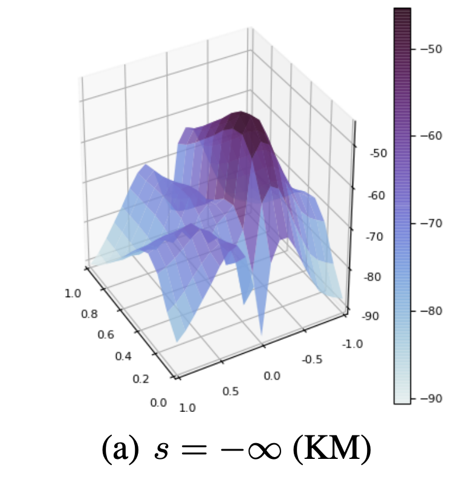
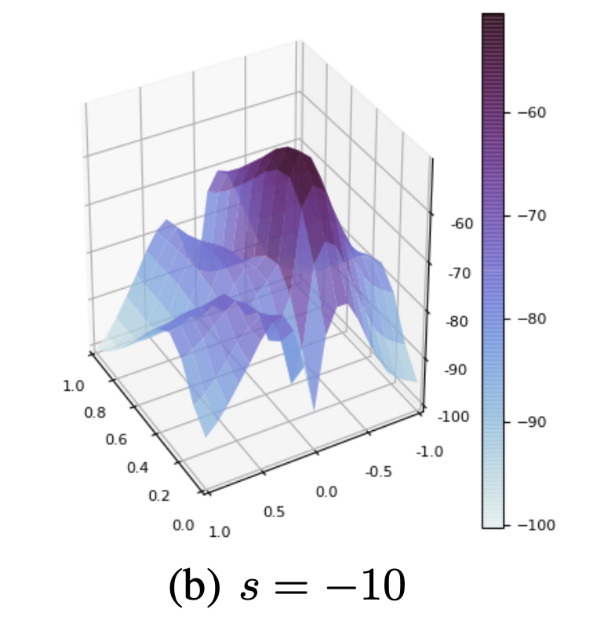
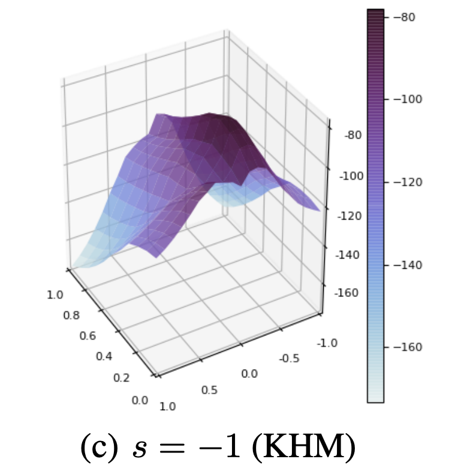
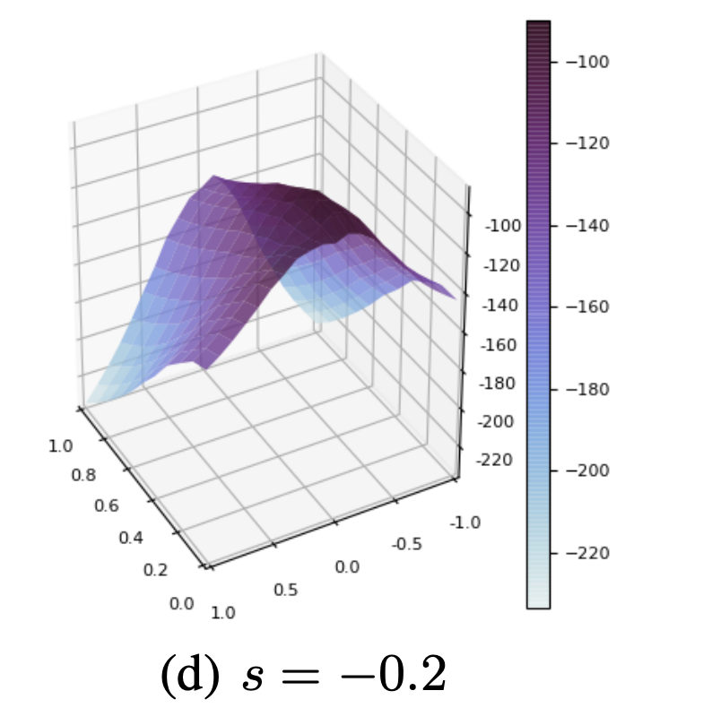
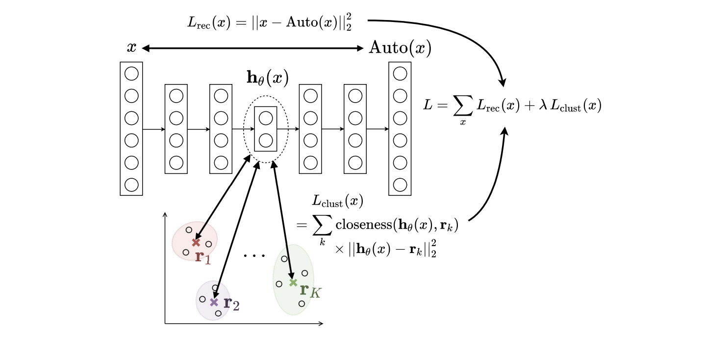

# Deep Power k-means framework

## Introduction

This is an experimental framework to jointly learn cluster representations and optimise the power K means objective. This work is inspired by the two papers :  


* [Power k-Means Clustering](http://proceedings.mlr.press/v97/xu19a/xu19a.pdf). 


| | | | |
|:-------------------------:|:-------------------------:|:-------------------------:|:-------------------------:|
| |   |  | 


Power K-means tries to optimise the k-means objective iteratively through a series of smoother power-mean objectives, using the Majorisation-Minimisation principle, by exploiting the concavity of the kolmogorov mean for s <= 1.

----

* [Deep k-Means: Jointly clustering with k-Means and learning representations](https://arxiv.org/pdf/1806.10069.pdf)

<p>
  
<p>

In deep K-means, low dimensional cluster representations are jointly learned using an Auto-encoder loss and a differentiable surrogate for the K-means objective.  

---


This implementation allows you to jointly optimise the power means objective together with the auto-encoder loss for each iteration of the power k-means algorithm. Following Deep K-means, the power-mean loss in each iteration is computed on the low dimensional cluster and data representations.

_While tuning parameters, please keep in mind that the starting value of the **power_k** param (s), should be <= 1 to ensure convergence and   
                                                                                                                 < 0 to use the multiplicative schedule implemented here._


## Dependencies
```
* Python
* Pytorch
* numpy
* scipy
* scikit-learn
* pickle
* matplotlib
```

## Run on your dataset

1. Store your dataset in a .npz file with :  

```                                                                                                       
dataset['feature'] = array of shape (num_samples, feat_dim)
dataset['target'] = array of shape (num_samples,)
``` 
                                                                                                        
2. Run the run.py with input_path for the dataset.npz file and output path for the results and plots. Other hyper-parameters as modified as required. The complete list of tunable parameters can be found in opts.py.  
```
python run.py --input_path --output_path --plot_path
```
